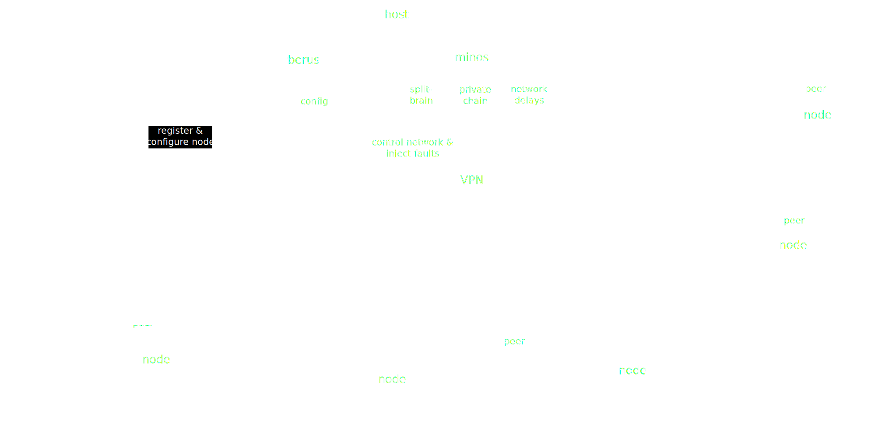

# Agenda

----

* Introduction round: why we are here?
* Local cluster experiments (Brian W. Bush)
* A VPN for Tartarus (Arnaud Bailly)
* Next steps (discussion)

# Local Cluster Experiment

----

- *Purpose:* highlight issues and techniques for adversial network studies
- *Approach:* start small and check against theory
- Initial network ("Proserpina")
    - Five honest nodes (56% stake)
    - Four adversarial nodes (44% stake)
    - Control over network connecting honest and adversarial nodes
- Two studies
    - Check block production against theory
    - Private-fork attack

## Diagnostic study

- Simply observe block production in the network
- Statistical tests
    - Correct number of blocks are produced
    - All nodes produce blocks at the same rate
    - Gaps in block production are geometrically distributed
- [Jupyter notebook](https://github.com/cardano-scaling/tartarus/blob/main/proserpina/diagnostics.ipynb)

## Private Adversarial Fork - Setup

Honest and adversary party have resp. $p$ and $q$ fraction of the stake

1. Adversary isolates their nodes from the honest ones.
2. Adversary builds a private fork $A$ while honest party builds honest fork $H$.

---

Adversary monitors the two forks:

1. $|H| - |A| \geq m$, then the adversary gives up
   a. Adversary adopts $H$ and starts over building $A$
2. $|A| - |H| \geq n$, the adversary reveals $A$ to the honest parties
   a. Honest party is compelled to adopt $A$ through the longest chain rule

## Private Adversarial Fork - Results

- Five times realtime: 0.2 slot/second
- Approximately 1400 attacks in 24 hours
    - 56 successful attacks
    - 1349 failed attacks
- Theory predicts a 4.15% success rate
- Actual success rate is 3.99%
- A chi-squared test indicates that actuality matches expectations

## Private Adversarial Fork - Findings

- The 9.2.1 version of `cardano-testnet` fails to run a local testnet.
- The 9.2.1 version of `cardano-node` silently omits important messages from the log when the logging flow is too great.
- Block production and private-fork attacks on `cardano-node` match theory.
- Many helper scripts will be needed to orchestrate attack scenarios on the testnet.

# Running Tartarus over VPN

## The Idea

* A Cardano testnet running over a publicly accessible VPN
* Peers register to join the VPN ([Cerberus](https://en.wikipedia.org/wiki/Greek_underworld#Cerberus)) using given configuration
* Nodes connect to each other through the VPN
* Adversary ([Minos](https://en.wikipedia.org/wiki/Minos)) injects _faults_ at predefined points in time
* Peers and Tartarus collect data and statistics about the network

----

## More ideas

> To become the [Jepsen](https://jepsen.io) of Cardano (and possibly other blockchains?)

* Regular reports and dashboards to the community
* Register for VPN IP address on-chain
* Allow contribution of new adversarial scenarios run by _Minos_
* On-chain transactions to fund infrastructure costs?

# Discussion

# Stay in touch

* [Github repository](https://github.com/cardano-scaling/tartarus)
* [Discord channel](https://discord.gg/3Ps9yPgh)
* [`brian.bush@iohk.io`](mailto:brian.bush@iohk.io)
* [`arnaud@pankzsoft.com`](mailto:arnaud@pankzsoft.com)
